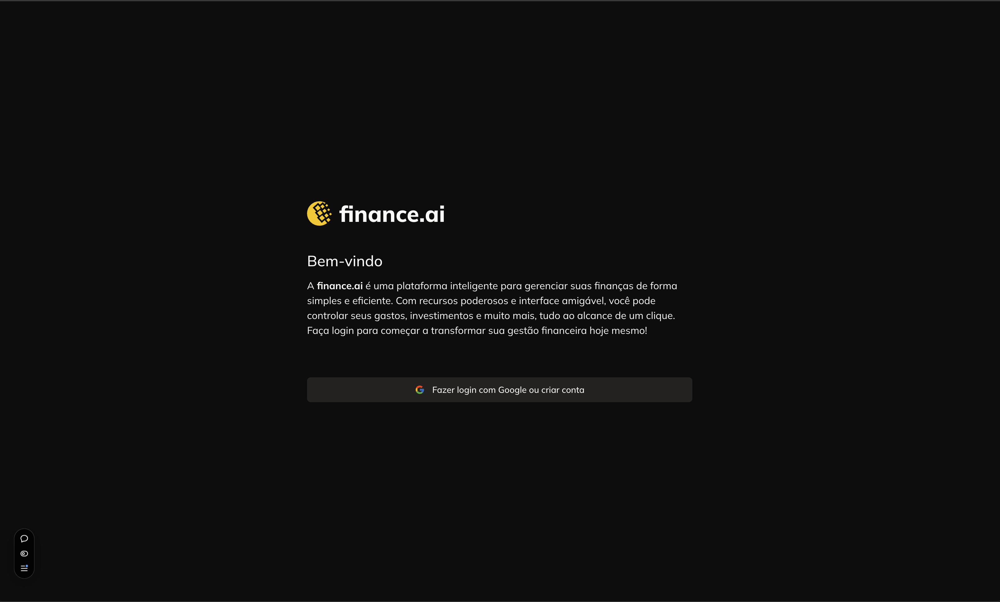
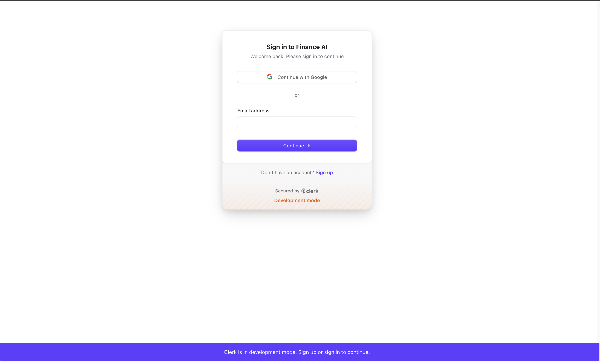
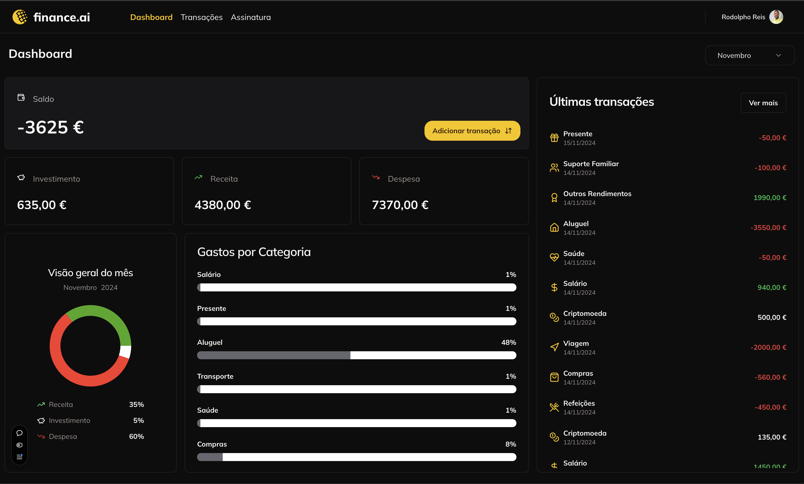
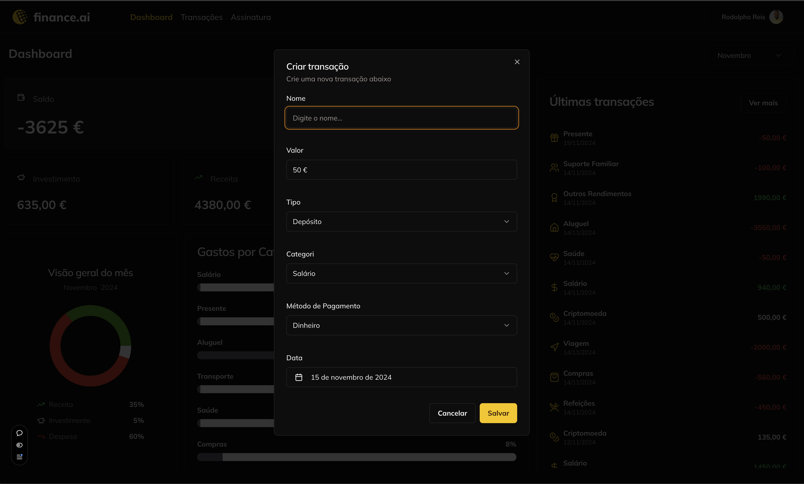
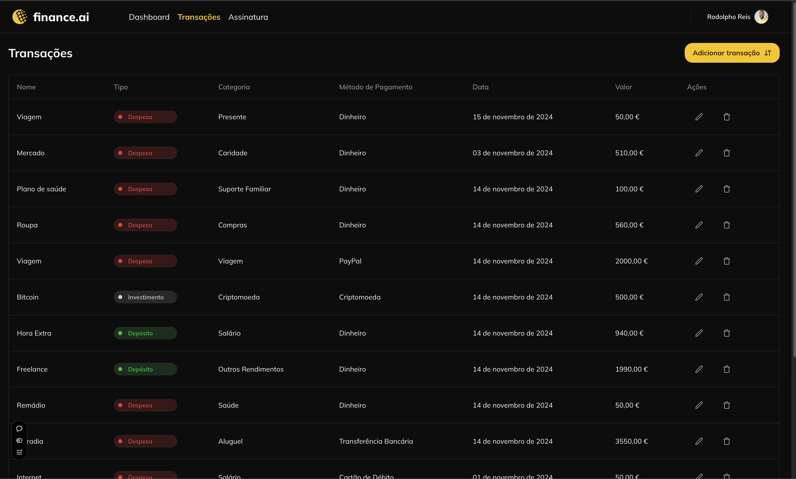
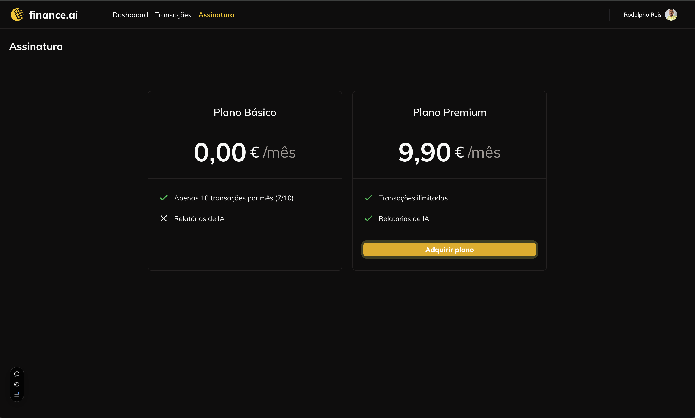

# Finance AI

## Deploy
Este projeto está disponível online. Acesse a versão deployada [aqui](https://finance-ai-theta.vercel.app/login) (clique com o botão direito e escolha "Abrir link em uma nova aba").

## Instalação
Para começar a usar este projeto, siga estas etapas:

1. Clone o repositório:
   ```bash
   git clone git@github.com:rodolphoreis/finance-ai.git
   cd finance-ai
   
   ```

2. **Inicie o servidor de desenvolvimento:**

   ```bash
   npm install

   ```

3. **Inicie o servidor de desenvolvimento:**
    ```bash
   npm run dev

   ```
   

4. **Abra o navegador e navegue até** [http://localhost:3000](http://localhost:3000) para a aplicação.


## Funcionalidades

- Controle de Gastos Pessoal: Aplique o controle e monitoramento dos seus gastos pessoais de maneira prática e eficiente.
- Integração com Inteligência Artificial (Futura): Futuramente, a IA será integrada para gerar relatórios inteligentes sobre seus hábitos financeiros e sugerir formas de economia.
- Assinaturas Premium: A funcionalidade de planos pagos será integrada, permitindo acesso a relatórios mais detalhados.
- Autenticação com Clerk: A autenticação de usuários é feita com o Clerk para um login seguro.
- Pagamentos via Stripe: O sistema de pagamento está configurado com Stripe para gerenciamento de assinaturas e pagamentos.
- Gráficos Interativos: Utiliza Shadcn e Recharts para mostrar gráficos e dados financeiros de maneira clara e interativa.

## Imagens do Projeto

  
_Home_

  
_Login_

  
_Dashboard_


  
_Adicionar Transação_

  
_Transações_

  
_Assinatura_


##  Tecnologias Utilizadas

- Frontend: Next.js, React, Tailwind CSS, Shadcn, Recharts, React Icons.
- Backend: Prisma, Stripe, Clerk para autenticação.
- Gerenciamento de Estado: React Hook Form, React Table para a exibição de dados.
- Design Responsivo: Interface otimizada para desktop (Mobile em desenvolvimento).
- Animações e UI: Tailwind CSS para a estilização, com animações e transições suaves.

## Roadmap

- Versão 1.0: Implementação da funcionalidade de planos Premium para acesso a relatórios avançados.
- Versão 2.0: Integração com IA para geração de relatórios personalizados.
- Mobile: O aplicativo será otimizado para dispositivos móveis na próxima versão.
- Obs: Estas funcionalidades ainda não estão disponíveis na versão atual.

## Contribuição

Contribuições são bem-vindas! Se você gostaria de contribuir para este projeto, por favor, faça um fork do repositório e envie um pull request com suas alterações.
